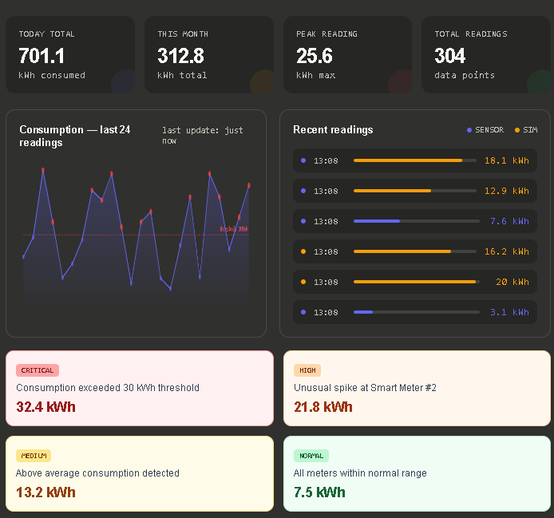

## 📊 Dashboard Preview




# ⚡ Smart Energy Monitoring System

A production-ready backend system built with **Java 17**, **Spring Boot 3**, **PostgreSQL**, and **Docker** that simulates real-time energy consumption monitoring — similar to systems used at energy grid operators like **Svenska kraftnät**.

---

## 🚀 Features

| Feature | Description |
|---|---|
| 🔐 JWT Authentication | Secure register/login with role-based access (ADMIN / USER) |
| ⚡ Energy Readings | CRUD operations for energy consumption data |
| 📊 Statistics | Daily/monthly totals, averages, peak consumption |
| 🔄 Real-time Simulation | Spring Scheduler generates sensor data every 30 seconds |
| 🚨 Smart Alerts | Auto-generates alerts when consumption exceeds threshold |
| 🐳 Docker Ready | Full containerization with Docker Compose |
| 🧪 Tested | Unit tests (Mockito) + Integration tests (MockMvc) |

---

## 🏗️ Architecture

```
smart-energy-monitor/
├── src/main/java/com/energy/
│   ├── controller/         # REST API endpoints
│   ├── service/            # Business logic
│   ├── repository/         # JPA data access
│   ├── model/              # JPA entities
│   ├── dto/                # Request/Response DTOs
│   ├── security/           # JWT filter & utilities
│   ├── config/             # Security & CORS config
│   └── scheduler/          # Real-time data simulation
├── src/test/               # Unit & Integration tests
├── docker-compose.yml
├── Dockerfile
└── pom.xml
```

---

## 🔧 Tech Stack

- **Java 17** + **Spring Boot 3.2**
- **Spring Security** + **JWT (JJWT)**
- **Spring Data JPA** + **PostgreSQL**
- **Spring Scheduling** (real-time simulation)
- **Docker** + **Docker Compose**
- **Lombok** (clean boilerplate)
- **JUnit 5** + **Mockito** + **MockMvc**

---

## 📦 Quick Start

### Option 1: Docker (Recommended)

```bash
git clone https://github.com/yourusername/smart-energy-monitor.git
cd smart-energy-monitor
docker-compose up --build
```

App runs at: `http://localhost:8080`

### Option 2: Local Setup

**Requirements:** Java 17+, Maven 3.9+, PostgreSQL 15+

```bash
# 1. Create database
createdb energy_db

# 2. Set environment variables (or edit application.yml)
export DB_USERNAME=postgres
export DB_PASSWORD=your_password

# 3. Run
mvn spring-boot:run
```

---

## 🌐 API Reference

### Authentication

```http
POST /api/auth/register
Content-Type: application/json

{
  "username": "alice",
  "email": "alice@example.com",
  "password": "secret123"
}
```

```http
POST /api/auth/login
Content-Type: application/json

{
  "username": "alice",
  "password": "secret123"
}
```

**Response:**
```json
{
  "token": "eyJhbGciOiJIUzI1NiJ9...",
  "username": "alice",
  "role": "USER"
}
```

### Energy Readings

```http
# Add a reading
POST /api/energy
Authorization: Bearer <token>

{
  "consumptionKwh": 7.5,
  "location": "Main Meter"
}

# Get all my readings
GET /api/energy
Authorization: Bearer <token>

# Get statistics
GET /api/energy/stats
Authorization: Bearer <token>

# Get alerts
GET /api/energy/alerts
Authorization: Bearer <token>

# Acknowledge an alert
PUT /api/energy/alerts/{id}/acknowledge
Authorization: Bearer <token>
```

### Stats Response Example

```json
{
  "totalToday": 45.2,
  "totalThisMonth": 312.8,
  "averageDaily": 8.4,
  "peakConsumption": 25.6,
  "totalReadings": 248
}
```

---

## 🔄 Real-time Simulation

Every **30 seconds**, the scheduler automatically generates energy readings (1–16 kWh) for all users, simulating sensor data. If consumption exceeds **10 kWh**, an alert is created with severity: `LOW → MEDIUM → HIGH → CRITICAL`.

This mirrors real-world energy grid monitoring systems.

---

## 🧪 Running Tests

```bash
mvn test
```

Tests use an **H2 in-memory database** — no PostgreSQL required for testing.

---

## 🔒 Security

- Passwords hashed with **BCrypt**
- Stateless sessions with **JWT**
- Role-based endpoint protection (`ADMIN` / `USER`)
- CORS configured for frontend at `localhost:3000` / `localhost:5173`

---

## 📈 Potential Enhancements

- [ ] Apache Kafka for event-driven architecture
- [ ] WebSocket for live dashboard updates
- [ ] React frontend dashboard
- [ ] Prometheus + Grafana metrics
- [ ] Rate limiting with Spring Rate Limiter

---

## 👨‍💻 Author

Built as a portfolio project demonstrating real-world backend development skills relevant to energy sector systems (Svenska kraftnät, Vattenfall, E.ON).
